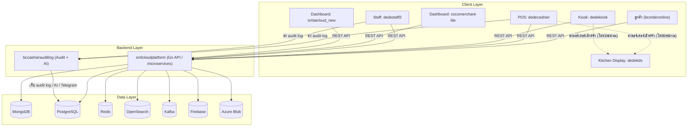

# DEDE POS / SML Cloud Platform

แพลตฟอร์มบริหารร้านอาหาร/ค้าปลีกและระบบขายหน้าร้าน (POS) ครบวงจร รองรับหลายแบรนด์ เช่น DEDE POS, BC POS, SML AI Cloud และ DoHome

## ภาพรวม (Overview)

Repository นี้เป็น monorepo สำหรับ ecosystem ของ DEDE POS / SML Cloud Platform ที่รวมระบบหน้าร้าน (POS, kiosk, staff), ระบบครัว (KDS), เว็บสั่งอาหารออนไลน์ฝั่งลูกค้า, dashboard สำหรับร้านค้าและการวิเคราะห์ข้อมูล, backend microservices และระบบ audit log สำหรับติดตามการทำงานของแคชเชียร์/พนักงาน

## สถาปัตยกรรม (Architecture)

Client ทุกตัวเรียก REST API ที่ `smlcloudplatform` เป็น backend หลัก ส่วน `dedecashier` และ `dedestaff2` ส่ง audit log ไปยัง `bccashierauditlog` เพื่อเก็บใน PostgreSQL วิเคราะห์ด้วย AI และแจ้งผ่าน Telegram

## ตารางสรุประบบทั้งหมด

| ระบบ | ประเภท | เทคโนโลยี | หน้าที่โดยย่อ |
|---|---|---|---|
| `smlcloudplatform` | Backend microservices platform | Go 1.18, Echo, MongoDB, PostgreSQL, Redis, OpenSearch, Kafka | ชั้นข้อมูลกลางและ REST API สำหรับ auth, shop, master data, member, transaction, upload, search, WebSocket และงาน consume ต่างๆ |
| `bccashierauditlog` | Backend audit service | Node.js, TypeScript, Fastify, PostgreSQL | รับ audit log จาก POS/staff วิเคราะห์ด้วย AI และรองรับการดู bug-signal/table timeline |
| `dedecashier` | POS หลัก | Flutter (Dart), multi-platform | ระบบขายหน้าร้าน multi-flavor พร้อม payment, printer, หลายภาษา และ audit log |
| `dedekiosk` | Self-service kiosk / order station | Flutter (Dart), ObjectBox, Firebase | kiosk หลายแพลตฟอร์ม รองรับ payment, printer, KDS, loyalty และ local database สำหรับ offline |
| `dedestaff2` | Staff app / order station | Flutter (Dart) | แอปพนักงานสำหรับรับออร์เดอร์/จัดการงาน POS variant และส่ง audit log |
| `dedekds` | Kitchen Display System | Flutter (Dart), build_runner | แสดงออร์เดอร์ให้พนักงานครัวแบบเรียลไทม์ (โดยประมาณ) และเชื่อม backend API |
| `cocomerchant-lite` | Merchant dashboard | Flutter (Dart), Firebase | dashboard วิเคราะห์ข้อมูล จัดการธุรกิจ auth หลาย provider เชื่อม Google Sheets และอัปโหลดไฟล์ |
| `smlaicloud_new` | Analytics + AI dashboard | Flutter (Dart), Firebase Hosting/Auth | dashboard วิเคราะห์ข้อมูลและ AI สำหรับหลายแบรนด์บน web/mobile พร้อม export Excel |
| `bcorderonline` | Customer web ordering | Vue 3, Vite, TypeScript, PrimeVue | เว็บฝั่งลูกค้าสำหรับสั่งอาหารที่โต๊ะ จัดการ cart/session เรียกพนักงาน และส่งออร์เดอร์ |

## รายละเอียดแต่ละระบบ

### Backend & Platform

#### `smlcloudplatform`

- **หน้าที่:** backend microservices platform หลัก เป็นชั้นข้อมูลกลางของ ecosystem
- **เทคโนโลยี/แพลตฟอร์ม:** Go 1.18, Echo framework, microservices ใน `/cmd`
- **ฟีเจอร์เด่น:** `authenticationservice` สำหรับ auth/JWT, `shopservice`, `masterdataservice` สำหรับสินค้า/หมวดหมู่, `memberservice` สำหรับสมาชิก/loyalty, `transactionservice` สำหรับออร์เดอร์/ธุรกรรม, `imageuploadservice`/`mediauploadservice`, `migrationapi`, `glservice` สำหรับบัญชี/รายงาน (โดยประมาณ), `journalconsume`, `inventorysearchconsumer`, `productbarcodeconsumer`, `ws` และ `datatransfer`
- **การเชื่อมต่อ/integration:** MongoDB, PostgreSQL ผ่าน GORM, Redis, OpenSearch, Kafka (Confluent), Firebase auth, Azure Blob Storage, JWT (RSA) และ Swagger docs

#### `bccashierauditlog`

- **หน้าที่:** backend audit log aggregator และ AI analyzer สำหรับ operation ของแคชเชียร์/พนักงาน
- **เทคโนโลยี/แพลตฟอร์ม:** Node.js, TypeScript, Fastify, PostgreSQL, REST API
- **ฟีเจอร์เด่น:** รับ sync audit log จาก `dedecashier` และ `dedestaff2` ผ่าน `POST /api/audit/sync`, วิเคราะห์ด้วย AI (OpenAI), ตอบคำถามผ่าน Telegram, ตรวจ bug-signal ผ่าน `/api/audit/bug-signals` และ replay เหตุการณ์ราย table ผ่าน `/api/audit/table-timeline`
- **การเชื่อมต่อ/integration:** PostgreSQL, OpenAI API, Telegram Bot และ Cloudflare Tunnel

### ระบบขายหน้าร้าน / อุปกรณ์หน้างาน (POS & front-of-house)

#### `dedecashier`

- **หน้าที่:** ระบบขายหน้าร้าน (POS) หลัก และ core POS engine แบบ multi-flavor
- **เทคโนโลยี/แพลตฟอร์ม:** Flutter (Dart) สำหรับ Android, iOS, Windows, macOS และ Web
- **ฟีเจอร์เด่น:** หลาย flavor ได้แก่ `dedecashier`, `dedepos`, `bcpos`, `vfpos`, `marinepos`, `smlaipos`, `smlmobilesales`, `smlsuperpos`; รองรับ payment gateway, เครื่องพิมพ์ความร้อนสำหรับใบเสร็จและออร์เดอร์ครัว, หลายภาษา และ audit log
- **การเชื่อมต่อ/integration:** payment providers เช่น PromptPay, LugentPay, GBPrimePay, Xendit, TigerBoard, MongoDB, Firebase, backend API และ `bccashierauditlog`

#### `dedekiosk`

- **หน้าที่:** kiosk บริการตัวเอง / order station สำหรับร้านอาหาร
- **เทคโนโลยี/แพลตฟอร์ม:** Flutter (Dart) สำหรับ Android, iOS, Windows และ Web
- **ฟีเจอร์เด่น:** 2 flavor คือ `dedekiosk` และ `bckiosk`, UI kiosk หลายภาษา, payment gateway, เครื่องพิมพ์ความร้อน, เชื่อม KDS, ระบบสมาชิก/loyalty, Firebase auth และ ObjectBox สำหรับ local database รองรับ offline
- **การเชื่อมต่อ/integration:** payment providers เช่น TigerBoard, LugentPay, PromptPay, GBPrimePay, Xendit, Firebase, ObjectBox และ backend API

#### `dedestaff2`

- **หน้าที่:** แอปฝั่งพนักงานสำหรับรับออร์เดอร์และจัดการงานหน้าร้าน
- **เทคโนโลยี/แพลตฟอร์ม:** Flutter (Dart) สำหรับ Android, iOS และ Windows
- **ฟีเจอร์เด่น:** order station/POS variant, สร้าง audit log และตั้งค่า Telegram bot ผ่าน `--dart-define`
- **การเชื่อมต่อ/integration:** backend API, Telegram Bot และ `bccashierauditlog`

#### `dedekds`

- **หน้าที่:** Kitchen Display System สำหรับแสดงออร์เดอร์ให้พนักงานครัว
- **เทคโนโลยี/แพลตฟอร์ม:** Flutter (Dart) หลายแพลตฟอร์ม ใช้ `build_runner` สำหรับ generate code
- **ฟีเจอร์เด่น:** แสดงออร์เดอร์แบบเรียลไทม์ (โดยประมาณ)
- **การเชื่อมต่อ/integration:** backend API และรับ flow ออร์เดอร์จาก POS/kiosk เข้าครัว (โดยประมาณ)

### Dashboard ร้านค้า / วิเคราะห์ข้อมูล

#### `cocomerchant-lite`

- **หน้าที่:** dashboard ร้านค้าสำหรับดูวิเคราะห์ข้อมูลและจัดการธุรกิจ
- **เทคโนโลยี/แพลตฟอร์ม:** Flutter (Dart) สำหรับ Android, iOS และ Web
- **ฟีเจอร์เด่น:** dashboard วิเคราะห์ด้วย charts เช่น Syncfusion และ `fl_chart`, UI หลายภาษา (ไทย/อังกฤษ/ลาว/จีน/ญี่ปุ่น/เกาหลี), Firebase auth, Google และ Apple Sign-In, เชื่อม Google Sheets, สร้าง QR และอัปโหลดไฟล์
- **การเชื่อมต่อ/integration:** Firebase, Google Sign-In, GSheets API และ REST API

#### `smlaicloud_new`

- **หน้าที่:** dashboard วิเคราะห์ข้อมูล + AI สำหรับร้านค้าแบบหลายแบรนด์
- **เทคโนโลยี/แพลตฟอร์ม:** Flutter (Dart) สำหรับ mobile และ web, Firebase Hosting
- **ฟีเจอร์เด่น:** 2 product line คือ "SML SMLAiCloud" และ "SML DoHome" รวม 6 deployment จาก 3 environment x 2 product, dashboard วิเคราะห์, charts, ตารางข้อมูล, หลายภาษา และ export Excel
- **การเชื่อมต่อ/integration:** Firebase Hosting/Auth และ backend API

### ฝั่งลูกค้า (Customer)

#### `bcorderonline`

- **หน้าที่:** เว็บฝั่งลูกค้าสำหรับสั่งอาหารที่โต๊ะ
- **เทคโนโลยี/แพลตฟอร์ม:** Vue 3, Vite, TypeScript, PrimeVue, SPA
- **ฟีเจอร์เด่น:** cart แบบ session, เลือกสินค้า, ส่งออร์เดอร์เป็น batch, เรียกพนักงาน, หลายภาษา และจัดการ session/cart
- **การเชื่อมต่อ/integration:** REST API ของ backend สำหรับ order, product และ category

## เทคโนโลยีหลัก (Tech Stack)

- **Backend:** Go (Echo) สำหรับ backend microservices และ Node.js/TypeScript + Fastify สำหรับ audit service
- **Frontend / App:** Flutter สำหรับแอปหลายแพลตฟอร์ม และ Vue 3 + Vite สำหรับเว็บสั่งอาหาร
- **Database / Storage:** MongoDB, PostgreSQL, Redis, OpenSearch และ Azure Blob
- **Message / Async:** Kafka (Confluent)
- **Platform integrations:** Firebase, payment gateways, OpenAI API, Telegram Bot, Google Sign-In และ GSheets API

## โครงสร้าง Monorepo

- `bccashierauditlog/` - backend audit log aggregator และ AI analyzer
- `bcorderonline/` - เว็บสั่งอาหารออนไลน์ฝั่งลูกค้า
- `cocomerchant-lite/` - dashboard ร้านค้าสำหรับวิเคราะห์ข้อมูลและจัดการธุรกิจ
- `dedecashier/` - core POS engine และระบบขายหน้าร้านหลัก
- `dedekds/` - Kitchen Display System สำหรับครัว
- `dedekiosk/` - self-service kiosk / order station
- `dedestaff2/` - แอปพนักงานสำหรับรับออร์เดอร์และจัดการงานหน้าร้าน
- `smlaicloud_new/` - dashboard วิเคราะห์ข้อมูล + AI สำหรับหลายแบรนด์
- `smlcloudplatform/` - backend microservices platform หลัก

## การเริ่มต้นใช้งาน (Getting Started)

แต่ละระบบมีวิธี build/run ของตัวเองในโฟลเดอร์นั้น โปรดดู README ย่อยหรือเอกสาร dev guide ภายในแต่ละโปรเจกต์ เช่น `dedekiosk/CLAUDE.md` สำหรับแนวทางของ `dedekiosk`

ก่อนรันระบบต้องตั้งค่า environment variables เอง โดยดูจากไฟล์ตัวอย่าง เช่น `.env.example` หรือ `keystore.properties.example` ในแต่ละโปรเจกต์ Repository นี้ไม่มีไฟล์ secret จริง ไฟล์ดังกล่าวเป็น template สำหรับตั้งค่าในเครื่องหรือ environment ที่ต้องการใช้งาน

หมายเหตุ: เอกสารนี้เป็นภาพรวมระดับ monorepo ระบบจริงบางส่วนใช้หลาย flavor หรือหลายแบรนด์จาก codebase เดียวกัน
